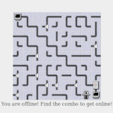

# An Offline Life (js13kgames-2018 contribution)

This is my contribution to [js13kgames][js13kgames] in 2018.
It is inspired by the „[Free Hours][commitstrip-free-hours]” comic of CommitStrip.

## Getting started

Clone the repo, install the dependencies and execute `npm start`.

Then open [index.html](http://localhost:8080/index.html) in a browser.

## Credits

This projects would not have been possible without the contributions by others.
It makes use of the following works:

* [kontra][kontra] by [Steven Lambert][kontra-creator] - MIT
* [mastermind-game][mastermind] by [Diana Thayer][mastermind-creator] - GPL v3.0
* Switch by [Gerd][switch-creator] from [source][switch-source] - CC BY 3.0
* Computers and network elements by [Andi Peredri][network-creator] from [source][network-source] - GPL v3.0
* Dial up sound by [William Termini][modem-creator] from [Wikipedia][modem-source] - Public domain
* [Audacity][audacity] - without it I wouldn't have been able to include sound.
* [GIMP][gimp] by [The GIMP Team][gimp-creator] - without it I wouldn't have been able to do all the arts you see.
* [HTML Minifier][html-minifier] by [Juriy Zaytsev][html-minifier-creator] - eased the inlining. Will keep that package handy for other projects, too. 
* [Nation][nation] by [Tobias Herber][nation-creator] - came in handy as I needed something more lightweight than Redux :-)
* [Rollup][rollup] - without it I wouldn't have been able to piece together everything.
* [Terser][terser] by [Fábio Santos][terser-creator] - it optimises the heck out of your code!

## Documentation

After cloning the repo and installing the deps, run `npm run doc` and look
into the new `docs` directory.

## Known Issues

If you are starting this app with a file: protocol under a Chromium-based
browser (Chrome, Opera and that like), make sure, you are
[configuring the cookie settings correctly][cookie-restriction].

## License

GPL v3+. See [License][license] for details.

[audacity]: https://www.audacityteam.org/
[commitstrip-free-hours]: https://www.commitstrip.com/en/2018/08/27/childhood-of-a-coder-free-hours/
[cookie-restriction]: https://stackoverflow.com/a/33047477
[gimp]: https://www.gimp.org/
[gimp-creator]: https://www.gimp.org/team.html
[html-minifier]: https://kangax.github.io/html-minifier/
[html-minifier-creator]: http://perfectionkills.com/
[js13kgames]: https://2018.js13kgames.com/
[kontra]: https://straker.github.io/kontra/
[kontra-creator]: https://sklambert.com/
[license]: ./LICENSE.txt
[mastermind]: https://github.com/garbados/mastermind-game
[mastermind-creator]: https://github.com/garbados
[modem-creator]: https://termini.me/
[modem-source]: https://en.wikipedia.org/wiki/File:Dial_up_modem_noises.ogg
[nation]: https://www.npmjs.com/package/nation
[nation-creator]: https://tobihrbr.com/
[network-creator]: https://opengameart.org/users/andi
[network-source]: https://opengameart.org/content/computers-and-network-elements
[rollup]: https://rollupjs.org
[switch-creator]: https://opengameart.org/users/pechvogel
[switch-source]: https://opengameart.org/content/switch-0
[terser]: https://www.npmjs.com/package/terser
[terser-creator]: https://fabiosantoscode.blogspot.com/
